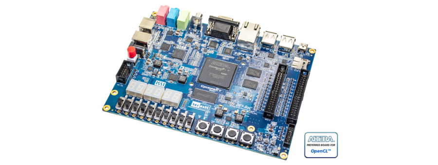
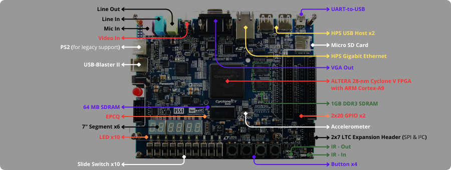

 

# Working with FPGA and MIPS-based Systems

This repository contains my hands-on work and practical sessions (TPs) focusing on FPGA programming and MIPS-based systems. Using the `ALTERA Cyclone V DE-1 SoC` board, I explore various embedded system applications.

These sessions include tasks such as assembly and C programming for embedded systems, system design using Intel Monitor Program, and working with NIOS II processors. The repository will be continuously updated with new sessions and implementations.

## ALTERA Cyclone V DE-1 SoC Board

The DE-1 SoC board is a `D`evelopment and `E`ducation board that integrates an ALTERA SoC FPGA with an embedded ARM processor. It is included as an education platform in the ALTERA University Program. Here is the board block diagram:

## Related Resources

- **FPGA Programming for Beginners**: Learn FPGA concepts through a structured study of the "FPGA Programming for Beginners" book by Frank Bruno. [Link to the repo](https://github.com/Choaib-ELMADI/fpga-programming-for-beginners)
- **Getting Started with VHDL**: Explore the fundamentals of VHDL programming with practical exercises and projects. [Link to the repo](https://github.com/Choaib-ELMADI/getting-started-with-vhdl)

## Goals

- Gain hands-on experience with FPGA programming and MIPS-based systems.
- Document each practical session and share insights.
- Build reusable resources for embedded systems learners.

## How to Use This Repository

- **Browse the sessions**: Explore each session folder to view my implementations.
- **Code and Projects**: Access the assembly and C files used for NIOS II programming.
- **Exercises**: Solutions for exercises are included for learning purposes.

## Practical Sessions (TPs)

### [TP 1 - Introduction to NIOS II and Embedded Programming](./TP1/)

### [TP 2 - Input and Output Peripherals Using NIOS II Interruptions](./TP2/)

### [TP 3 - Introduction to Intel Platform Designer](./TP3/)

### [TP 4 - Simple Processor Design and Implementation](./TP4/)

Feel free to explore and contribute if you have any suggestions or improvements.
